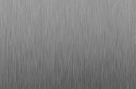

# SPECIAL TAGS

- ```<wbr>``` wbr - criar quebra de palavras 
- ```&nbsp;``` - it is "space" 
- ```<i>``` - Itálico
- ```<b>``` - para negrito
- ```<em>``` - enfase
    - ```<i> e <em>``` os dois fazem as palavras ficarem inclinada, mas semanticamente ```<em>``` estar dizendo para navegador que vc quer enfatizar esse termo, não somente a palavra inclinada
- ```<u>``` - a tag underline foi depreciada no HTML5, era usado no HTML3, hj underline é utilizado com CSS
- ```<del>``` - <del> é a palavra riscada
- ```<span>``` - utilizada para formatar pequenos texto
    - ex: ```<span style="text-decoration: underline;>``` linha underline
    - ```<span style="text-decoration: line-through;>``` é o riscado igual o ```<del>```, mas com significado sematico diferente
    - ```<span   style="text-decoration: overline;">``` linha acima do texto
    - ```<span style="text-decoration: none;">``` que não altera em nada o texto, mas semanticamente, ele bloqueia alteração que vem no CSS por exemplo.
    - ```<span style="font-weight:normal;">``` o paramento font-weight vai criar a quantidade de negrito que palavra terá
        - ```normal``` - sem efeito
        - ```bold``` - negrito
        - ```bolder``` - mais negrito
        - ```100 até 900``` - usando de 100 até 900 de % negrito
- ```style``` - para alinhamento, antigamente se usava ```align```. 
    - ```<h2 style:"text-align: left;">``` usando para esquerda
        - ```right``` para direita
        - ```center``` para centralizar  
        - ```justify```estilo justificado 
- ```text-indent:``` é utilizado para paragrafo, sendo 1 até 100
    - ```<h2 style:"text-align: left; text-indent:50">``` 


````
<p>Exemplos de <sup>Formatação</sup></p>```
<p> x<sup> 2</sup> e H<sub>2</sub>O</p>```
````
<p>Exemplos de <sup>Formatação</sup></p>
<p> x<sup> 2</sup> e H<sub>2</sub>O</p>


- ```<code>```serve para exibir codigo no navegador
- ```<pre>```é usado para deixa o pré formatado
    - ```&lt```é para < 
    - ```&gt```é para >
 ```
 // Código de C++

 <pre> 
 <code>
 #include &lt;iostream&gt;
 int main() {
     cout << "Olá Mundo!";
     return 0;
 }
</code>
</pre>
```

## Listas em HTML5 com OL e UL
- ```<nav>```é uma tag criada no HTML5 para barra de navegação
- ```<ol>```lista ordenada ou Ordered lists
    -  ```<ol type="1">``` TYPE -> temos 5 tipos de listas ordenadas: 1, A, a, i, I (# romanos)
    - ```<ol type="1" start="3">``` o START indica que a ordemed lists vai começar com o número 3. Start só aceita valores númericos e romanos.       
- ```<ul>```Unordered lists
    - ```<ul type="square">``` TYPE -> temos 3 tipos de Unordered lists: CIRCLE, SQUARE ou DISC(valor padrão).

Podemos também criar hierarquia com listas, utilizando tags OL e UL aninhadas. 
        
- ```<li>``` list items

 exemplo:
````
<nav>
  <h1>Menu Principal</h1>
  <ol>
    <li>Home</li>
    <li>Especificações</li>
    <li>Fotos</li>
    <li>Multimídia</li>
    <li>Fale conosco</li>
  </ol>
</nav>
````

## Links em HTML5
 - ```<a href="https://www.google.com/glass/start/" target="_blank">```
    - a tag ```<a>```  é conhecida coomo ancora 
    - href - é o site de referencia
    - target="_blank" -> é para abrir o site em outra aba. 
    - target="_self" _> é para abrir na mesma a pagina o site (não tem necessidade de usar o _self, pq por padrão ja abri na mesma pagina)

## Imagens em HTML5

- Arquivo PNG ->  é usado quando tem a necessidade de uma qualidade muito boa ou fotos em TRANSPARENCIA.
- ARQUIVO JPGE -> é mais indicado, pois não utiliza muito processamento e deixa seu site mais leve.

- `````` -> a foto veio do arquivo. 
    - src -> source

- A tag WIDTH ou HEIGHT serve para dimensionar a imagem foi depreciada no HTML5, mas alguns professores continuam ensinando dessa maneira: 
    - `````` 
        - O problema: o arquivo mesmo sendo minimizado com o HTML5 não altera o seu tamanho original, fazendo o download da imagem no formato original. Sendo assim, o arquivo minimizado vai estar demandando mais processamento do que tamanho exibido no HTML5, fazendo o site ficar mais pesado.      

- Photoshop ou Gimp -> Usado para reduzir a escala da imagem.
    - Depois salvar em formato JPG or PNG 
        - No Photoshop ->  SALVAR PARA WEB -> tem as opções:
            - JPG Baixo -> baixa resolução
            - JPG Média -> média resolução
            - JPG Alta -> alta resolução (indicado) 
            - JPG Muita Alta -> Mais alta resolução
            - JPG Maxima -> maxima resolução
        - No Gimp -> EXPORT AS -> Save as JPG or PNG

- ````<figure>```` -> serve para criar uma semantica para imagem, criando uma legenda para a imagem.
- ````<figcaption>````-> serve para criar uma legenda para imagem.
```
<figure>
    
    <figcaption>
        <h3>Google Glass</h3>
        <p>Uma nova maneira de ver o mundo.</p>
    </figcaption>
</figure>
```


## CSS 

- ```<link rel="stylesheet" type="text/css" href="_css/estilo.css"/>``` Essa formatação serve para chamar o arquivo CSS fora do arquivo html.  
    - CSS externo -> utilizamos a tag LINK com o parâmetro REL de valor STYLESHEET.

- ``` /* */``` /* Formatação de imagens com legendas */

- Class -> <figure class="foto-legendas">
    - No CSS sempre que usar o paramentro class, vc vai colocar o nome da tag, ponto o nome da class no CSS. 
    - figure.foto-legendas { }

- POSITION - Relative e Absolute
    - Utilizando o POSITION em CSS – Diferença entre RELATIVE e ABSOLUTE Existem dois tipos de posicionamento para CSS: com o POSITION RELATIVE, ele terá a localização feita em relação à sua posição atual. Para POSITION ABSOLUTE, ele terá a localização feita em relação a todo o conteúdo.
- BOX-SIZING -> CSS com BOX-SIZING com o parâmetro BORDER-BOX.
- OPACITY -> Cria transparencia 0 = 100% transparencia  / 1 = 100% sem transparencia
- TRANSITION -> ```transition: opacity 1s;``` usando trasition o objeto vai levar 1 segundo para aparecer


## Color CSS

- ``` color: rgba(0,0,0,0.5);```  RGB = vermelho/red (60), verde/green (45) e azul/blue (3E) - Cada valor é representado em base hexadecimal. ```A``` representa alpha, que vai de 0 até 1.
-  ```background-color: hsla(165, 81%, 93%, 0.5);```   hls() cria cores utilizando a representação percentual de Matiz (Hue), saturação (Saturation) e luminosidade (Brightness). Tbm podendo utilizar hlsa() ```A``` representando o Alpha.

## Menu com CSS3
- ```<nav id="menu">```criei no HTML um ID chamado de menu
    - ```nav#menu { }``` na pagina do CSS (estilo.css ), crie o nav#menu para a formatação. 
        - O ```#``` é usado sempre para ID.

````
/* Formatação do Menu */
nav#menu {
  display: block; /* display block vai fazer que q o container flutue na tela. */
}

nav#menu ul {
  list-style: none; /* vai tirar a marcação do UL */
  text-transform: uppercase; /* todas as palavras em letras MAIÚSCULA */
  position: absolute; /* Sendo que nav#menu já está como display block, usando o position absolute o containeir pode passar por cima dos documentos em qualquer lugar da pagina (livre dentro do site). Se usar position RELATIVA eu posso posicionar containeir por cima dos documentos que esse mini container estiver dentro (dentro do container)*/
  top: -20px; /* movimentando para o topo */
  left: 300px;
}

nav#menu li {
  display: inline-block; /* inline-block -> vai fazer ficar na mesma linha em blocos */
  background-color: #dddddd; /* cor do fundo */
  padding: 10px; /* vai criar um espaço dentro dos botoes */
  margin: 2px; /* vai criar um espaço fora dos botões */
}

nav#menu h1 {
  display: none; /* vai escoder tudo que for h1 */
}
````
## Fontes em CSS

````
@font-face { 
  font-family: FonteLogo; 
  src: url(../_fonts/bubblegum-sans-regular.otf);
} 
````
- O font-face é possível importar uma fonte.
- font-family: FonteLogo;  A fonte pode ser renomeada, para ser utilizada no CSS, estarei usando o FonteLogo no header#cabecalho h1 { } 
- src: url(../_fonts/bubblegum-sans-regular.otf); -> src = source é para importar no arquivo */


- ```google.com/fonts``` O Google tbm é um repositório de fonts
    - @import url('https://fonts.googleapis.com/css2?family=Cinzel+Decorative:wght@900&family=Titillium+Web:wght@400;900&display=swap'); /* cópiei essa fonte do google.com/fonts */


## Símbolos especiais
<p>
    video&shy;con&shy;ferên&shy;cia - &shy  gera a separação de sílabas com hifenização. (-)
    &lt; menor que... 
    <br>
    &gt; maior que...
    <br>
    &le; menor igual a...
    <br>
    &ge; maior igual a...
    <br>
    &pound; pound simbolo
    <br>
    &yen; yen simbolo
    <br>
    &euro; euro símbolo...
    <br>
    &copy; copiright simbolo
    <br>
    &reg; marca registrada simbolo
    <br>
    &trade; Trademark simbolo
    <br>
    &permil; porcentagem dividido por mil
    <br>
    &sum; simbolo de soma
    <br>
    &infin; infinito simbolo 
    <br>
    &times; simbolo de multiplicação
    <br>
    &plusmn; simbolo de mais ou menos
    <br>
    &oplus; simbolo mais dentro de um circuferência
    <br>
    &radic; raiz quadrada
    <br>
    &ne; não igual
    <br>
    &delta; delta minúsculo
    <br>
    &Delta; DELTA maiúsculo
    <br>
    &omega; omega simbolo
    <br>
    &phi; simbolo phi
    <br> 
    &larr; left arrow - seta para esquerda
    <br>
    &rarr; right arrow - seta para direita
    <br>
    &uarr; up arrow - seta para cima
    <br>
    &darr; down arrow - seta para baixo
    <br>
    &harr; seta para os dois lados
    <br>
    &Larr; &Larr se a primeira letra for maisucula o sinal da seta fica diferente
    <br> 
    &spades;
    &clubs;
    &hearts;
    &diams; naipes das cartas
</p>
